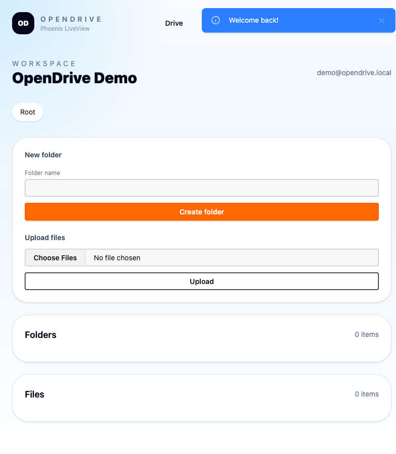

# OpenDrive

OpenDrive is a multi-tenant internal drive built with Elixir, Phoenix LiveView, SQLite/Turso-compatible metadata storage, and S3-compatible blob storage.



## Stack

- Elixir + Phoenix 1.8
- Phoenix LiveView
- Ecto + SQLite (`ecto_sqlite3`), compatible with Turso/libSQL-style metadata usage
- Pluggable blob storage via `OpenDrive.Storage`
- S3-compatible adapter with local fake storage for development and tests

## Current MVP

- Workspace-based multi-tenancy
- Owner/admin/member roles
- Email + password authentication
- Tenant switcher in session
- Folder creation
- File upload metadata + blob persistence
- Authenticated download flow
- Trash with soft delete + restore
- Basic audit trail for critical actions

## Local development

```bash
mix setup
mix ecto.migrate
mix phx.server
```

Then open [http://localhost:4000](http://localhost:4000).

## Tests

```bash
mix format
mix test
```

## Storage configuration

Development and tests use the fake adapter by default.

To switch to S3-compatible storage in runtime:

```bash
export OPEN_DRIVE_STORAGE_ADAPTER=s3
export AWS_S3_BUCKET=your-bucket
export AWS_ACCESS_KEY_ID=...
export AWS_SECRET_ACCESS_KEY=...
export AWS_REGION=us-east-1
```

Optional custom endpoint env vars:

```bash
export AWS_S3_HOST=localhost
export AWS_S3_PORT=9000
```

## Main modules

- `OpenDrive.Accounts`
- `OpenDrive.Tenancy`
- `OpenDrive.Drive`
- `OpenDrive.Audit`
- `OpenDrive.Storage`

## Notes

- Blob bytes are isolated from app logic behind `OpenDrive.Storage`.
- Tenant-bound reads and writes must always be scoped by `tenant_id`.
- The screenshot above was captured from the running local app.
