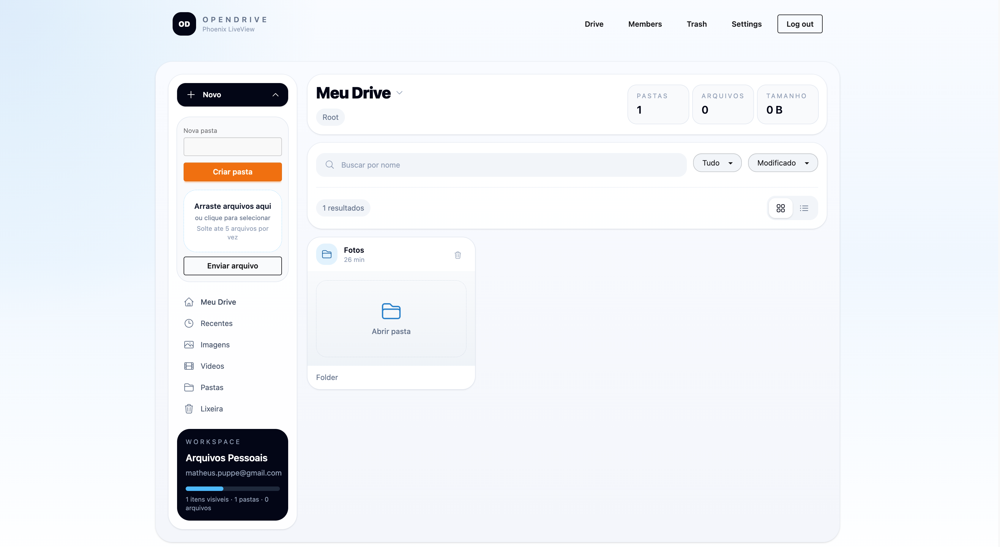

# OpenDrive

OpenDrive is a multi-tenant internal drive built with Elixir, Phoenix LiveView, SQLite metadata, and pluggable blob storage behind `OpenDrive.Storage`.



## Overview

The application is organized around workspaces (`tenants`). Each authenticated user operates inside one active workspace and all drive reads and writes are scoped by `tenant_id`.

Current product surface:

- Email/password authentication plus magic-link login support
- Workspace creation during registration
- Multi-tenant membership model with `owner`, `admin`, and `member` roles
- Tenant switcher for users who belong to multiple workspaces
- Folder tree navigation
- File upload through the Phoenix backend, with optional direct-to-storage primitives available in the codebase
- Authenticated single-file download and multi-file ZIP download
- Soft delete, trash listing, restore, and permanent empty-trash cleanup
- Audit log entries for key tenant, membership, and drive actions

## Stack

- Elixir `~> 1.15`
- Phoenix `~> 1.8.5`
- Phoenix LiveView `~> 1.1`
- Ecto + SQLite via `ecto_sqlite3`
- Tailwind CSS + esbuild
- S3-compatible storage adapter plus a fake local adapter for development and tests

## Domain structure

Main modules:

- `OpenDrive.Accounts`: registration, authentication, session tokens, password/email updates, scope bootstrap
- `OpenDrive.Tenancy`: workspace creation, membership listing, member management, scope resolution
- `OpenDrive.Drive`: folders, files, uploads, renames, downloads, trash, restore, ZIP assembly
- `OpenDrive.Audit`: tenant-scoped audit event persistence
- `OpenDrive.Storage`: blob storage facade with adapter-based implementation

Relevant web entrypoints:

- `lib/open_drive_web/router.ex`
- `lib/open_drive_web/live/drive_live/index.ex`
- `lib/open_drive_web/live/members_live/index.ex`
- `lib/open_drive_web/live/trash_live/index.ex`
- `lib/open_drive_web/controllers/direct_upload_controller.ex`
- `lib/open_drive_web/controllers/file_download_controller.ex`

## Data model

The current schema is composed of:

- `users`
- `users_tokens`
- `tenants`
- `memberships`
- `folders`
- `file_objects`
- `files`
- `audit_events`

Important storage and integrity rules:

- Tenant slug uniqueness is scoped by `owner_user_id`, not globally
- Active folders must have unique names within the same tenant + parent folder
- Active files must have unique names within the same tenant + folder
- Soft-deleted folders/files do not block reuse of the same name

## Local development

### Requirements

- Elixir `~> 1.15`
- Erlang/OTP compatible with Phoenix 1.8
- Node.js is not required globally; Tailwind and esbuild are installed through Mix tasks

### Bootstrapping

```bash
mix setup
mix phx.server
```

Then open [http://localhost:4000](http://localhost:4000).

`mix setup` runs:

- dependency install
- database creation and migrations
- `priv/repo/seeds.exs`
- Tailwind/esbuild installation
- asset build

At the moment, `priv/repo/seeds.exs` is only a placeholder, so the first user/workspace is created through the registration flow.

### Handy commands

```bash
mix test
mix precommit
mix ecto.reset
mix assets.build
```

## Authentication and workspace flow

- Anonymous users land on `/`
- Registration creates both the user and the first workspace in a single transaction
- Authenticated users are redirected to `/app`
- Users with more than one membership can switch the active workspace via `/app/switch-tenant`
- Member management is limited to owners and admins
- Adding a member requires that the invited email already exists as a registered OpenDrive user

## Upload and download flow

Uploads support two paths:

1. Direct upload preparation through `POST /app/uploads`
2. Backend proxy upload through `POST /app/uploads/proxy`

Direct uploads are signed with a Phoenix token and finalized through `POST /app/uploads/complete`.

Current operational limits from the code:

- Maximum upload size: `2 GB`
- Backend proxy threshold constant: `2 GB`
- ZIP download limit: `100 files`
- ZIP download total size limit: `500 MB`

The default runtime behavior now keeps uploads on the app origin up to the full `2 GB` limit. This avoids browser-side S3 CORS failures when the bucket is not configured for cross-origin `PUT` requests from the app domain.

Downloads support:

- Single file redirect through a presigned download URL
- ZIP generation for selected files

## Storage configuration

Three adapters implement the same `OpenDrive.Storage` behaviour, so the rest of the app does not care which one is in use. Pick one with `OPEN_DRIVE_STORAGE_ADAPTER`:

| Adapter | Value | Default in | Notes |
| --- | --- | --- | --- |
| Fake | `fake` | development and test | writes under the system temp dir; nothing leaves the machine |
| Backblaze B2 | `b2` | production (when unset) | native-friendly defaults; only the key and bucket are required |
| S3-compatible | `s3` | — | AWS S3 or any S3-compatible service with AWS-style credentials |

### Backblaze B2 (`b2`)

```bash
export OPEN_DRIVE_STORAGE_ADAPTER=b2
export B2_BUCKET=your-bucket
export B2_APPLICATION_KEY_ID=...
export B2_APPLICATION_KEY=...
export B2_REGION=us-east-005                        # optional, defaults to us-east-005
export B2_ENDPOINT=s3.us-east-005.backblazeb2.com   # optional, derived from B2_REGION
```

Create the application key in the Backblaze panel with access to the bucket and these capabilities: `listBuckets`, `listFiles`, `readFiles`, `writeFiles`, `deleteFiles`, `shareFiles`. The bucket can stay private — media is served through presigned URLs.

**TLS note:** Backblaze's S3 endpoint sits behind Cloudflare, which replies with a TLS 1.3 `HelloRetryRequest` that OTP's TLS client rejects (`hello_retry_middlebox_assert`). `config/runtime.exs` pins TLS 1.2 for `*.backblazeb2.com` hosts, so no action is needed when you use the `b2` adapter.

### S3-compatible (`s3`)

```bash
export OPEN_DRIVE_STORAGE_ADAPTER=s3
export AWS_S3_BUCKET=your-bucket
export AWS_ACCESS_KEY_ID=...
export AWS_SECRET_ACCESS_KEY=...
export AWS_REGION=us-east-1
```

Optional custom endpoint variables (MinIO, Ceph, R2, a VPC endpoint, …):

```bash
export AWS_S3_HOST=localhost
export AWS_S3_PORT=9000
export AWS_S3_SCHEME=http://
```

You can also place these variables in `.env.local` at the project root. `config/runtime.exs` loads that file automatically outside the test environment without overriding shell-exported variables.

### S3 permissions and policies

There are two different pieces involved when OpenDrive uses S3:

- IAM permissions for the server-side AWS credentials
- Bucket CORS rules for browser-based direct uploads

These solve different problems and both may be required.

#### 1. Bucket CORS for direct browser uploads

If the browser uploads directly with a presigned `PUT` URL, the bucket must allow cross-origin requests from the app origin — this applies to AWS S3 and to Backblaze B2 alike. Without it, the browser blocks the request and the UI falls back to `/app/uploads/proxy` (the upload still works, it just goes through the app server).

AWS S3, one-line command for local development:

```bash
aws s3api put-bucket-cors --bucket YOUR_BUCKET --cors-configuration '{"CORSRules":[{"AllowedOrigins":["http://127.0.0.1:4000","http://localhost:4000"],"AllowedMethods":["GET","HEAD","PUT"],"AllowedHeaders":["*"],"ExposeHeaders":["ETag"],"MaxAgeSeconds":3000}]}'
```

To verify:

```bash
aws s3api get-bucket-cors --bucket YOUR_BUCKET
```

Backblaze B2 expresses the same rules as `corsRules` on the bucket (Backblaze panel → Bucket → CORS Rules, or a `b2_update_bucket` call):

```json
[
  {
    "corsRuleName": "opendrive-web",
    "allowedOrigins": ["http://localhost:4000", "https://drive.example.com"],
    "allowedHeaders": ["*"],
    "allowedOperations": ["b2_download_file_by_name", "b2_download_file_by_id", "b2_upload_file", "b2_upload_part"],
    "exposeHeaders": ["ETag", "Content-Length"],
    "maxAgeSeconds": 3600
  }
]
```

Notes:

- Add any extra local or deployed origins you actually use, such as staging or production domains
- `PUT` (or `b2_upload_file`/`b2_upload_part`) is required for direct uploads
- `AllowedHeaders=["*"]` avoids preflight failures with presigned headers

#### 2. Credentials: IAM policy (AWS) or application key (B2)

With the `b2` adapter there is no IAM to write: the application key created in the Backblaze panel already scopes the access (bucket + capabilities listed [above](#backblaze-b2-b2)). Skip to the [Database configuration](#database-configuration) section.

With the `s3` adapter on AWS, the credentials used by `OpenDrive.Storage.S3` need permission to manage the objects stored by the app. A minimal example looks like this:

```json
{
  "Version": "2012-10-17",
  "Statement": [
    {
      "Sid": "OpenDriveBucketList",
      "Effect": "Allow",
      "Action": [
        "s3:ListBucket"
      ],
      "Resource": "arn:aws:s3:::YOUR_BUCKET"
    },
    {
      "Sid": "OpenDriveObjectAccess",
      "Effect": "Allow",
      "Action": [
        "s3:GetObject",
        "s3:PutObject",
        "s3:DeleteObject",
        "s3:AbortMultipartUpload"
      ],
      "Resource": "arn:aws:s3:::YOUR_BUCKET/*"
    }
  ]
}
```

If you want the same IAM principal to inspect or manage bucket CORS from the CLI, add:

```json
"s3:GetBucketCORS",
"s3:PutBucketCORS"
```

on the bucket resource `arn:aws:s3:::YOUR_BUCKET`.

## Database configuration

Default database files:

- Development: `open_drive_dev.db`
- Test: `open_drive_test.db`
- Production fallback when `DATABASE_PATH` is set: custom path
- Production fallback without `DATABASE_PATH`: `/tmp/open_drive.db`

To override the runtime database path:

```bash
export DATABASE_PATH=/absolute/path/to/open_drive.db
```

## Deploy with Kamal

The repository now includes a production `Dockerfile` and a starter Kamal config in `config/deploy.yml`.

Current production assumptions:

- Phoenix runs as a release on port `4000`
- SQLite lives in `/data/open_drive.db` inside the container
- Kamal mounts the host path `/var/lib/open_drive` into `/data`
- Blob storage stays on S3 via `OPEN_DRIVE_STORAGE_ADAPTER=s3`
- Health checks use `GET /up`

Before the first deploy:

```bash
mix phx.gen.secret
```

Put the generated value plus your AWS credentials in `.kamal/secrets`:

```bash
SECRET_KEY_BASE=...
AWS_ACCESS_KEY_ID=...
AWS_SECRET_ACCESS_KEY=...
```

Adjust these placeholders in `config/deploy.yml`:

- `proxy.host`
- `servers.web.hosts`
- `env.clear.PHX_HOST`
- `env.clear.AWS_S3_BUCKET`
- `ssh.user` if your server user is not `ubuntu`

If you want to build remotely through a Docker host over SSH, you can still run:

```bash
DOCKER_HOST=ssh://your-server-alias kamal setup
DOCKER_HOST=ssh://your-server-alias kamal deploy
```

Typical first-run flow:

```bash
kamal setup
kamal deploy
```

## Quality gate

Project checks are grouped in:

```bash
mix precommit
```

That alias runs:

- compile with warnings as errors
- `mix deps.unlock --unused`
- format check
- Credo strict mode
- tests

If you want the same gate before each push:

```bash
git config core.hooksPath .githooks
```

## Notes for contributors

- Keep tenant-aware behavior scoped through the current workspace context
- Prefer changing the smallest layer that solves the problem
- Preserve blob handling behind `OpenDrive.Storage`
- For root-level UI metadata and global assets, start with `lib/open_drive_web/components/layouts/root.html.heex`
- For front-end work, keep the current Phoenix, Tailwind, and LiveView structure unless there is a concrete reason to refactor
